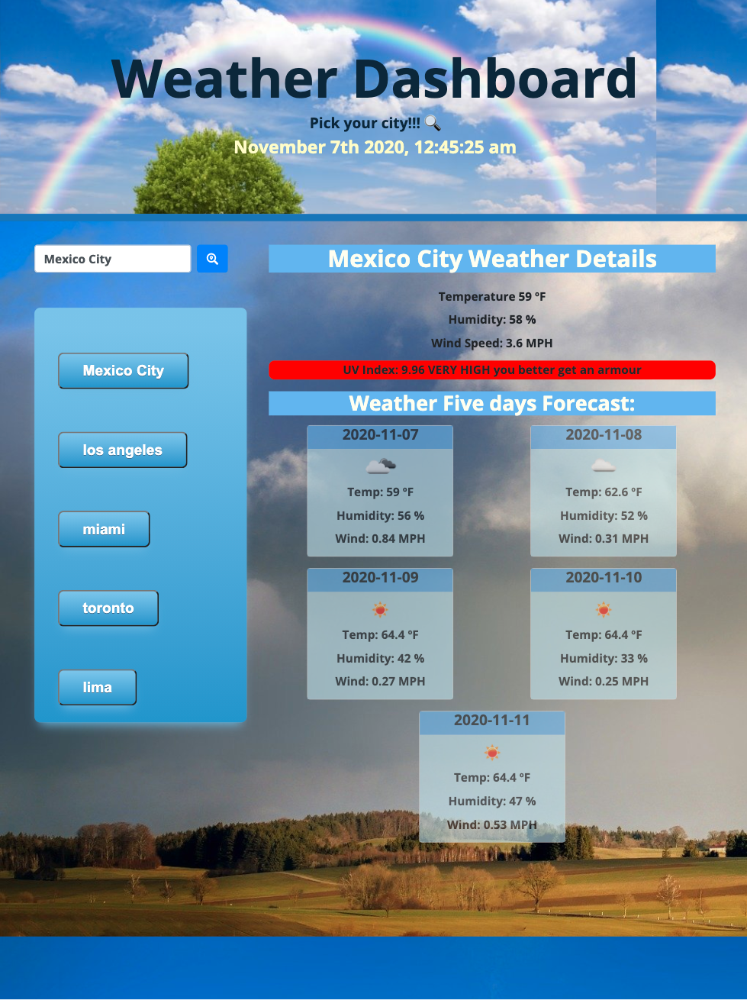

# Weather_Dashboard
Weather Dashboard using Server-Side APIs
AN application that allows you review the weather and deployed a five day forecast

# homework unit 06 Server-Side APIs:

## Why to create this app?

```
AS A traveler
I WANT to see the weather outlook for multiple cities
SO THAT I can plan a trip accordingly
```
## How to create a Weather Dashboard?

Using the Bootstrap CSS Framework to develop an app powered with JQUERY, using the [Moment.js](https://momentjs.com/) library to work with date and time, then Using the [OpenWeather API](https://openweathermap.org/api) to retrieve weather data for cities.


## How does it works?

```
GIVEN a weather dashboard with form inputs
WHEN I search for a city
THEN I am presented with current and future conditions for that city and that city is added to the search history
WHEN I view current weather conditions for that city
THEN I am presented with the city name, the date, an icon representation of weather conditions, the temperature, the humidity, the wind speed, and the UV index
WHEN I view the UV index
THEN I am presented with a color that indicates whether the conditions are favorable, moderate, or severe
WHEN I view future weather conditions for that city
THEN I am presented with a 5-day forecast that displays the date, an icon representation of weather conditions, the temperature, and the humidity
WHEN I click on a city in the search history
THEN I am again presented with current and future conditions for that city
WHEN I open the weather dashboard
THEN I am presented with the last searched city forecast
```

## Mock-Up

The following picture shows how the application looks:




## Credits 

To solve the needs to this subject, I use the following pages 
- https://www.w3schools.com/
- https://getbootstrap.com/
- https://momentjs.com/
- https://stackoverflow.com/
- https://openweathermap.org/api


## Challenge

the difficulty of this homework was make the adequate link with the weather API
and make the synchronization with the current day and the forecast for the next five days, get the appropriate icon for the current weather, and the next, was give the appropriate color to the UV index, because the classes were overwriting every time they called; I managed to create the list of cities after the search and turn it into a button, but I could add the link to the weather again. I didn’t have more time to make it work. And the localStorage is very hard for me, I do not quit understand how to code that function, it is getting very difficult for me that particular part of the homework

## Contributing

- https://github.com/AlheliMi/Weather_Dashboard.git
- https://alhelimi.github.io/Weather_Dashboard/

